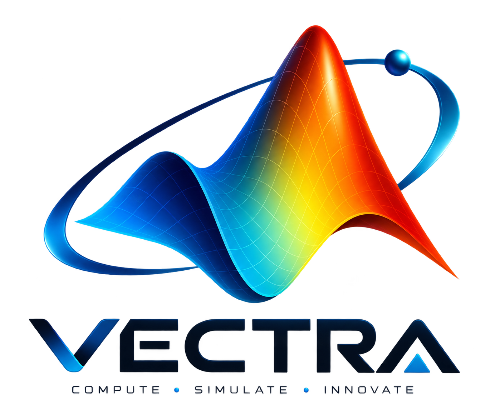

# Vectra — Scientific Computing & Engineering Desktop Environment



**Vectra** is a free, extensible, open-source desktop scientific computing environment and MATLAB-compatible alternative engineered specifically for Electronics & Communication Engineering (ECE) coursework, lab research, and numerical analysis.

---

## 🌟 Key Features

- **Standard MATLAB Language Syntax**: Range operators (`start:step:stop`), 1-based indexing, unparenthesized commands (`clc`, `clear`, `grid on`, `hold on`, `close all`), subplots, and mathematical expressions.
- **Modern Multi-Dock PySide6 IDE**:
  - **Script Editor**: Multi-tab code editor with line numbers, active line highlighting, and MATLAB syntax coloring.
  - **Command Window REPL**: History recall with `Up`/`Down` arrow keys, MATLAB `help <command>` documentation lookup, and command output formatting.
  - **Workspace Inspector**: Real-time table viewing variable shapes, types, and values.
  - **Current Folder Explorer**: Double-click `.m` scripts to open directly in the editor.
  - **Interactive Figure Window**: Embedded Matplotlib toolbar for panning, zooming, subplot configuration, and image export.
- **Integrated ECE Curriculum Toolboxes**:
  - **Signals & Systems (SS)**: `heaviside`, `unitstep`, `dirac`, `unitimpulse`, `sinc`, `square`, `sawtooth`, `chirp`, `rectpuls`, `tripuls`, `conv`, `deconv`, `xcorr`, `fft`.
  - **Digital Signal Processing (DSP)**: `butter`, `cheby1`, `cheby2`, `ellip`, `bessel`, `zplane`, `resample`, `decimate`, `interp`.
  - **Communication Systems**: `ammod`, `amdemod`, `fmmod`, `fmdemod`, `bpskmod`, `qpskmod`, `awgn`.
  - **Principles of Electromagnetics (PEM)**: `surf`, `mesh`, `meshgrid`, `quiver`, `quiver3`, `gradient`.
  - **Control Systems**: `tf(num, den)`, `step`, `impulse`, `bode`.
  - **Symbolic Mathematics**: `syms`, `diff`, `int` with expression operator overloading ($x^2 + 3x$).

---

## 🚀 Quick Start Guide (Windows)

1. Download or clone this repository as a `.zip` file from GitHub.
2. Extract the `.zip` folder.
3. Double-click **`Vectra.bat`** in the extracted root directory!

> `Vectra.bat` will automatically verify your Python environment, install required open-source dependencies (`NumPy`, `SciPy`, `SymPy`, `Matplotlib`, `PySide6`), and launch the desktop IDE.

---

## ⚡ Running From Terminal

```bash
# Install package in editable mode
pip install -e .

# Launch Desktop IDE
python -m kheramat.gui.app
```

---

## 📜 Example Script

```matlab
clc; clear; close all;

t = -2:0.01:2;

% Signals & Systems Lab Example
x1 = sin(2*pi*t) + cos(4*pi*t);
x2 = exp(-t/3).*sin(t);
u = (t >= 0);
x3 = 2*sin(2*pi*t) + 3*cos(4*pi*t) + 2*u;

subplot(3,1,1);
plot(t, x1);
xlabel('Time (t)'); ylabel('Amplitude');
title('x_1(t) = sin(2\pit) + cos(4\pit)');
grid on;

subplot(3,1,2);
plot(t, x2);
xlabel('Time (t)'); ylabel('Amplitude');
title('x_2(t) = e^{-t/3} sin(t)');
grid on;

subplot(3,1,3);
plot(t, x3);
xlabel('Time (t)'); ylabel('Amplitude');
title('x_3(t) = 2sin(2\pit) + 3cos(4\pit) + 2u(t)');
grid on;
```

---

## 🛡️ License & Open Source

Vectra is licensed under the MIT License. Built using standard Python scientific stack (`NumPy`, `SciPy`, `SymPy`, `Matplotlib`, `PySide6`).

